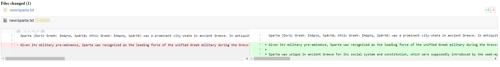
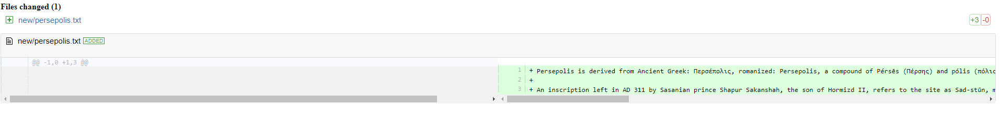
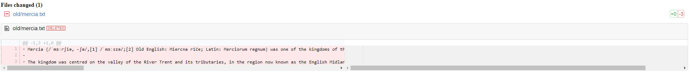

File Diff Generator
==================


---

## Installing

```bash
npm install file-diff-generator
```

## What is it?

`file-diff-generator` generates colourised differences between any kinds of files from two different sources and indicates if they were added, deleted or changed.

The added, deleted or changed files are collated into the output folder with the adddition of a file called `filesList.html` which contains hyperlinks to the relevant files in the output directory. This is useful if the output needs to be rendered by a web server. 

### Changed file


### Added file


### Deleted File


### Options
```
Usage:

file-diff-generator --new= NEW SOURCE --old= OLD SOURCE --output= DESTINATION [OPTIONS]

--regexReplacement An array of regular expressions in JSON to replace text in source files (default: none)

--merge Whether to merge all the output files into a single file called allResults.html (default: false)
```

### Usage Examples

```bash
file-diff-generator --new=/root/new --old=/root/old --output=/root/output
```

```bash
file-diff-generator --new=/root/new --old=/root/old --output=/root/output merge=true
```

```bash
file-diff-generator --new=/root/new --old=/root/old --output=/root/output --regexReplacement='[{ regex: /build.1278/, replacement: \"\" }]'
```

<div>Icon made by <a href="http://www.freepik.com" title="Freepik">Freepik</a> from <a href="https://www.flaticon.com/" title="Flaticon">www.flaticon.com</a></div>
